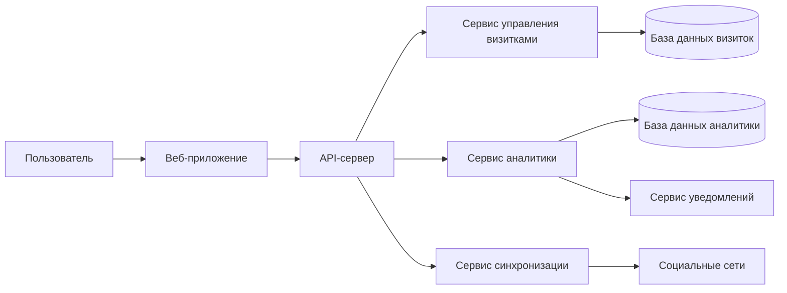
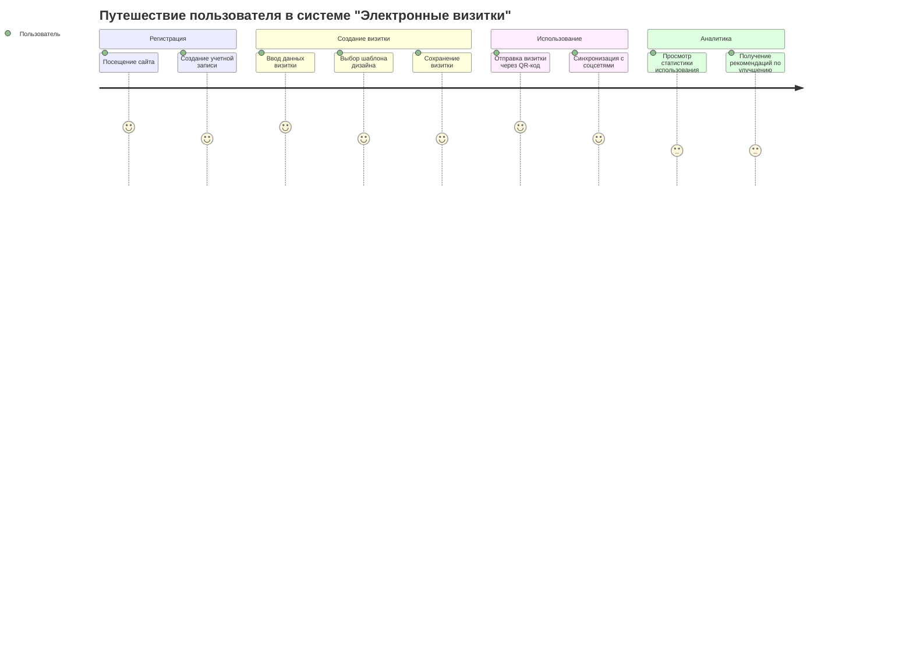
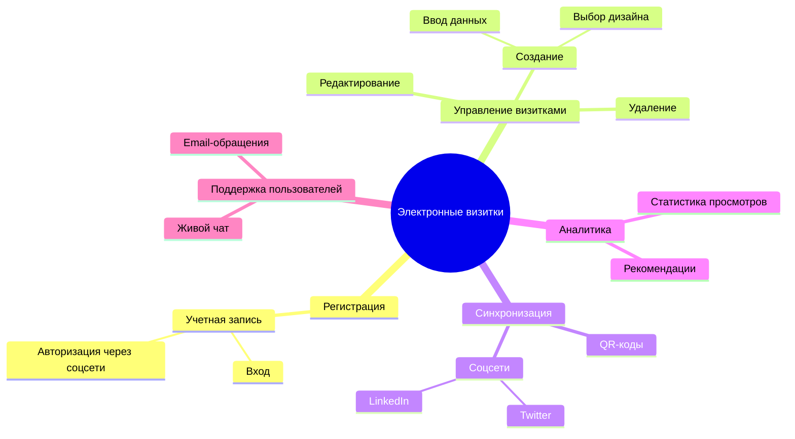
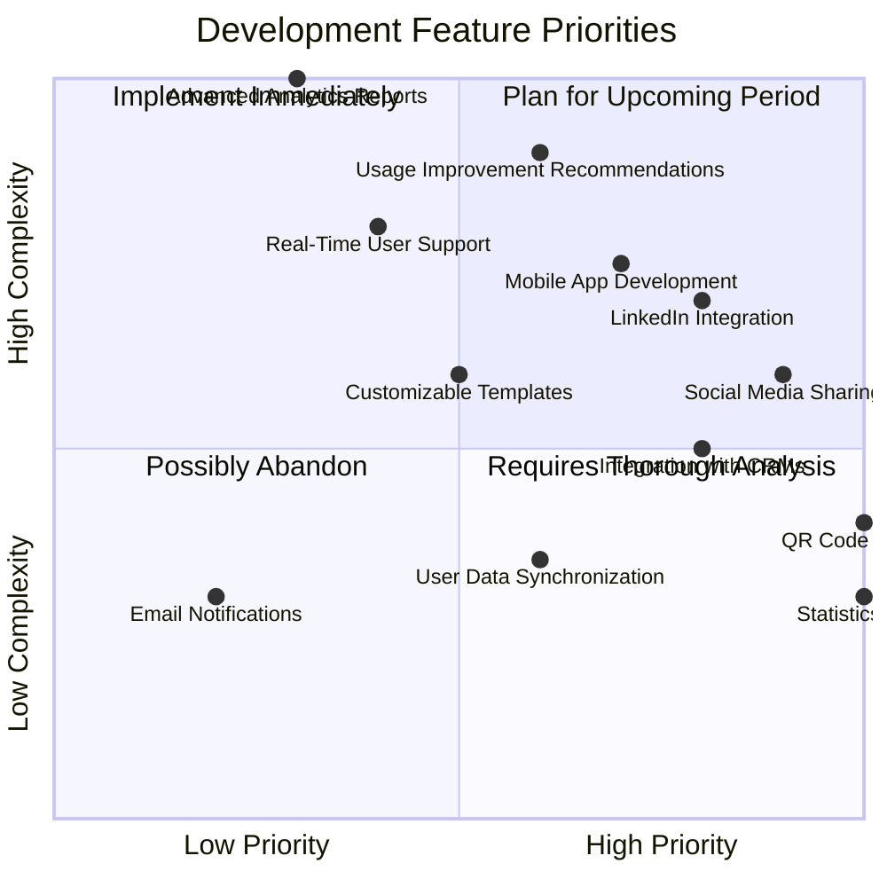
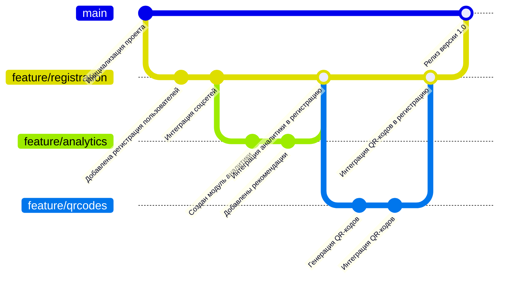

# Информационная система "Электронные визитки"

## Обзор проекта

Система **"Электронные визитки"** — это современное программное решение для создания, управления и обмена электронными визитными карточками. Она предоставляет пользователям возможность создавать персонализированные визитки, синхронизировать их с внешними сервисами и анализировать эффективность использования.

---

## Архитектура системы

### Описание архитектуры системы

1. **Пользователь**: взаимодействует с системой через веб-интерфейс.  
2. **API-сервер**: центральная точка обработки запросов, связывающая фронтенд с основными модулями.  
3. **Модули**:
   - **Сервис управления визитками**: создание, редактирование и удаление визиток.  
   - **Сервис аналитики**: сбор и предоставление данных об использовании визиток.  
   - **Сервис синхронизации**: обмен визитками с внешними сервисами.  
4. **Базы данных**:
   - Хранение данных визиток.  
   - Аналитика использования.  
5. **Интеграции**:
   - Социальные сети (например, LinkedIn).  
   - Сервис уведомлений для отправки сообщений.  

---

## Путешествие пользователя

### Детали путешествия пользователя

Процесс взаимодействия с системой разделен на этапы:  
1. **Регистрация**: создание учетной записи.  
2. **Создание визитки**: ввод данных, выбор дизайна и сохранение.  
3. **Использование**: обмен визитками через QR-коды или социальные сети.  
4. **Аналитика**: анализ данных использования визиток и получение рекомендаций.  

---

## Ментальная карта функциональности

---

## Стратегическая карта развития проекта (Квадрант-граф)

### Пояснения к квадрант-карте

#### Высокий приоритет (правый нижний квадрант):  
- **Интеграция с QR-кодами** и **создание статистики**: реализуются первыми из-за их высокой ценности и низкой сложности.  

#### Высокая сложность (правый верхний квадрант):  
- Функции вроде **поддержки реального времени** требуют дополнительного анализа.  

---

## Workflow разработки (Гит граф)

### Детали Workflow разработки

- **Модель разработки**: Git Flow.  
- **Технологический стек**:
  - **Фронтенд**: React.  
  - **Бэкенд**: Spring Boot.  
  - **Базы данных**: PostgreSQL и MongoDB.  

